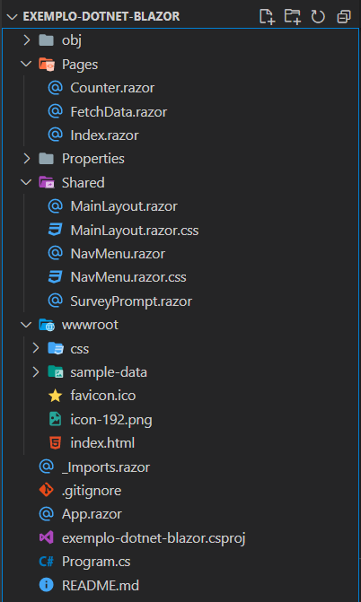

# Blazor WebAssembly

## Introdução
Blazor é uma tecnologia .NET para criar SPA, isso mesmo single page application, usando apenas HTML, CSS e C#, graças ao WebAssembly (WASM) é possivel utiliza C# para criar aplicações do lado do cliente.
O blazor possui dois modelos de hospedagem, Blazor Server que atualiza a interface utilizando SignalR e Blazor WASM, neste artigo vamos criar um projeto Blazor WASM.

Você pode acessar o repositorio desse projeto em
[exemplo-dotnet-enum](https://github.com/marcoswoc/exemplo-dotnet-enum).

## Pré-requisitos

+ .NET 5+
+ Visual Studio Code (VS Code)
+ Terminal de sua preferência

## Criando o projeto

Com o comando **`dotnet new blazorwasm`** vamos criar um projeto Blazor Webassembly.Voce pode usar o paramentro **`-o`** para indicar o nome da pasta em que o projeto sera criado.
    
    new blazorwasm -o exemplo-dotnet-blazor

## Estrutura do Projeto
Acessando a pasta do projeto via terminal podemos utilizar o comando **`code .`** para abrir o projeto no Vs Code, teremos a seguinte estrutura de arquivos:

### Pages

Nesta pasta contém os componentes/páginas roteáveis ( .razor ). A rota da pagina pode ser especificada no arquivo utilizando **`@page`**

### Shared

pasta: contém os seguintes componentes compartilhados e folhas de estilo

### wwwroot

A pasta raiz da Web para o aplicativo que contém os ativos estáticos públicos do aplicativo, incluindo appsettings.json e arquivos de configurações de aplicativo ambiental para definições de configuração. A index.html página da Web é a página raiz do aplicativo implementada como uma página HTML:

Quando qualquer página do aplicativo é solicitada inicialmente, essa página é renderizada e retornada na resposta.
A página especifica onde o App componente raiz é renderizado. O componente é renderizado no local do div elemento DOM com um id de app ( 
Loading...
 ).

### _Imports.razor
 Inclui Razor diretivas comuns para incluir nos componentes do aplicativo ( .razor ), como @using diretivas para namespaces.
### App.razor

O componente raiz do aplicativo que configura o roteamento do lado do cliente usando o Router componente. O Router componente intercepta a navegação do navegador e renderiza a página que corresponde ao endereço solicitado.

### Program.cs

O ponto de entrada do aplicativo que configura o host do Webassembly:

O App componente é o componente raiz do aplicativo. O App componente é especificado como o div elemento DOM com um id de app ( 
Loading...
 in wwwroot/index.html ) para o conjunto de componentes raiz ( builder.RootComponents.Add<App>("#app") ).
Os Serviços são adicionados e configurados (por exemplo, builder.Services.AddSingleton<IMyDependency, MyDependency>() ).

## Execultado o projeto
